# 🍔🍽️ Zomato Clone Website - Suresh Jaiswar

This is a **Zomato Clone Website** project created using **HTML**, **CSS**, and **JavaScript**.  
It replicates the basic front-end design and functionality of Zomato — including the homepage layout, restaurant listings, search functionality, and a fully responsive user interface.

---

## 📸 Screenshots

> Sample previews from the project UI:

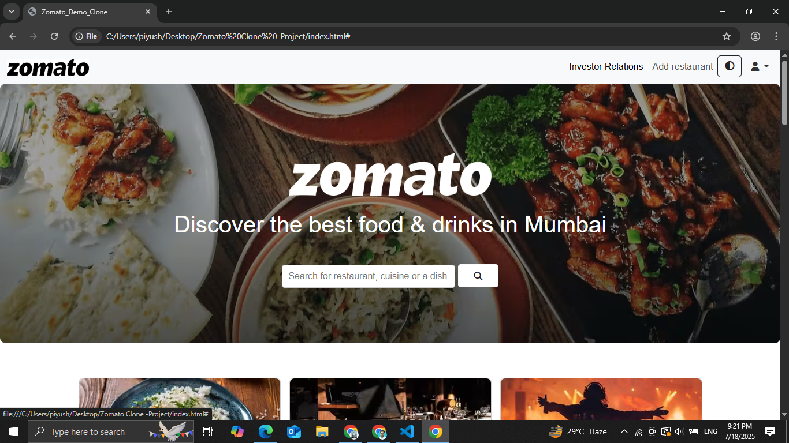  

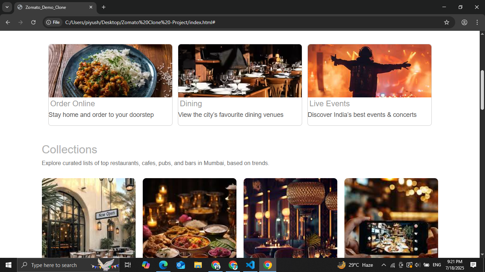  

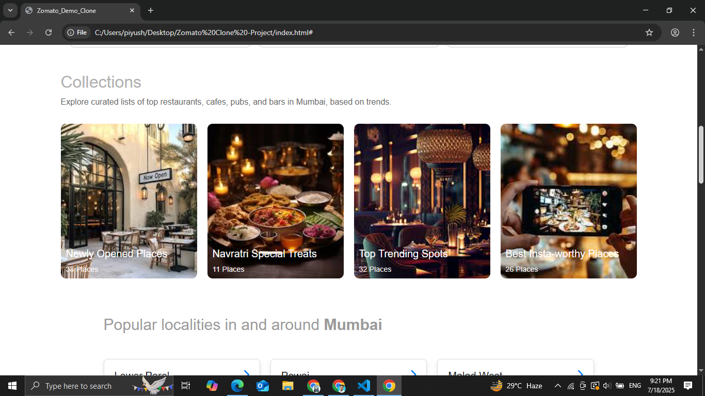  

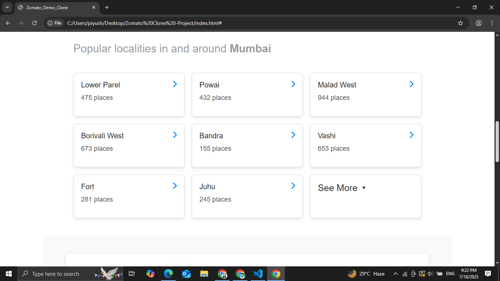  

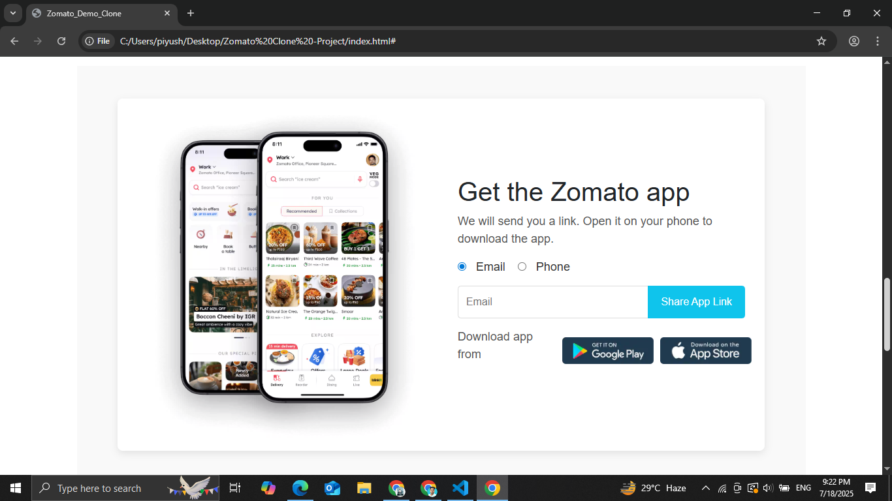  

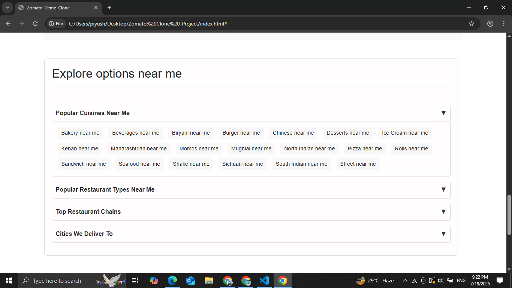  

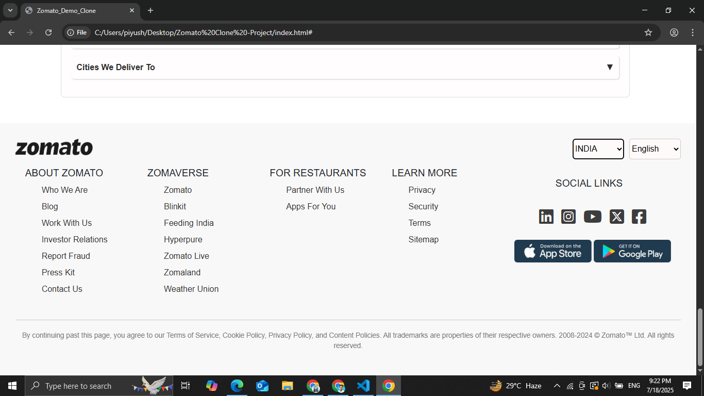  

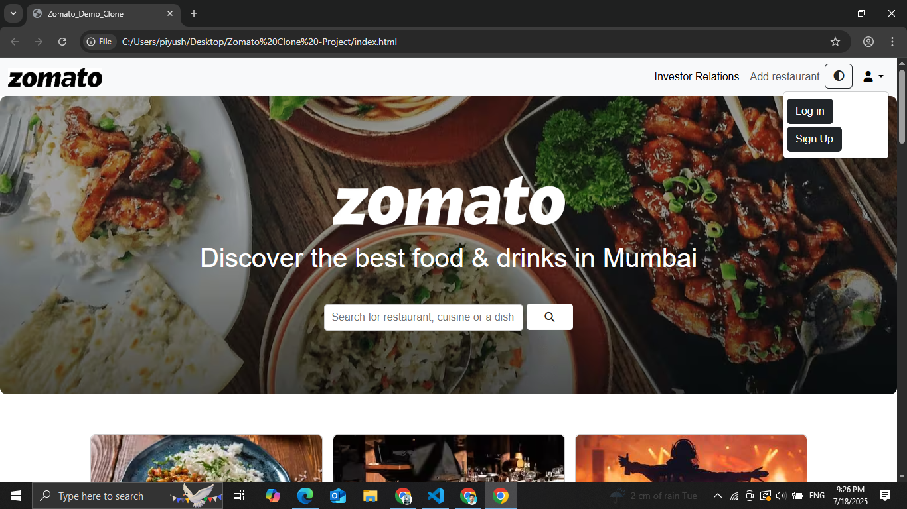  

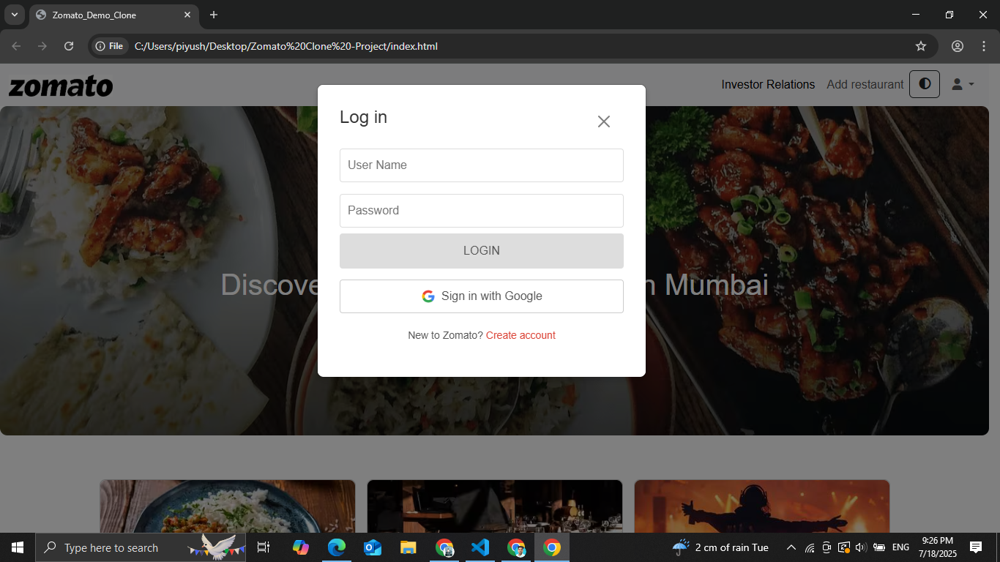  

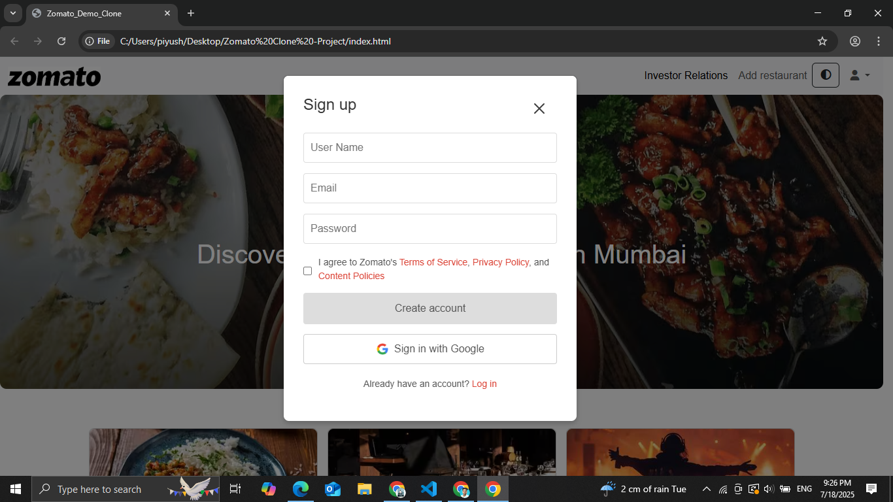  

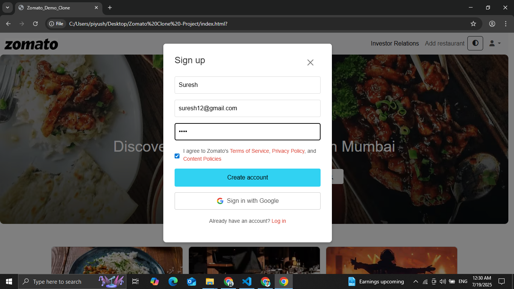  

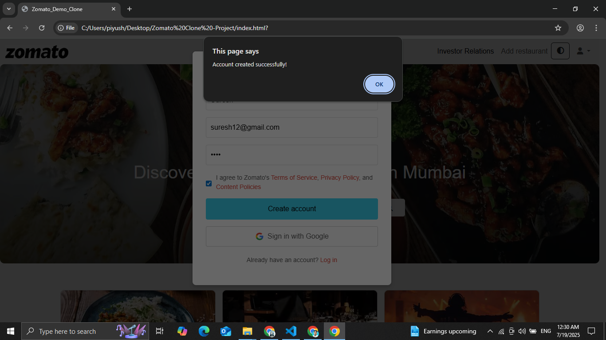  

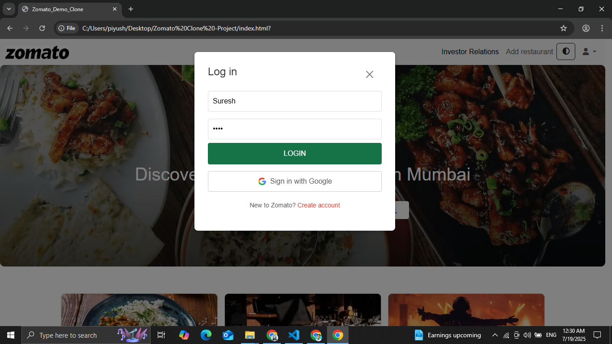  

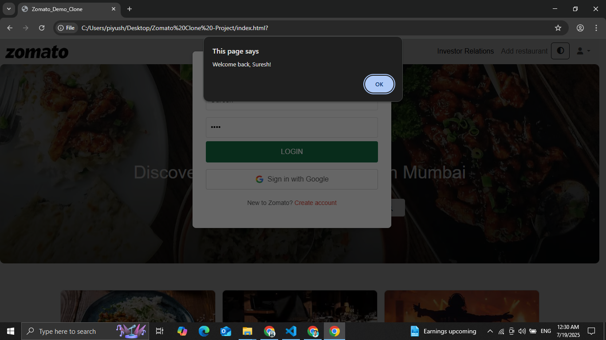  

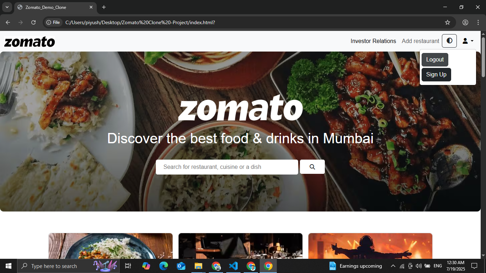

---

## 🚀 Features

- 🔍 Restaurant and food item search functionality  
- 📍 Location selection dropdown  
- 🖼️ High-quality front-end UI inspired by Zomato  
- 📱 Responsive design for mobile and desktop  
- 🌙 Optional Light/Dark Mode toggle  
- 🍽️ Sections like Delivery, Dining Out, Nightlife, and more  

---

## 🛠️ Tech Stack

- ✅ HTML5  
- 🎨 CSS3  
- ⚙️ JavaScript  

---

## 👨‍💻 Author

- **Suresh Jaiswar**
- [GitHub Profile](https://github.com/Suresh-Demon)
- [LinkedIn](https://www.linkedin.com/in/suresh-jaiswar-3338a027a/)

---